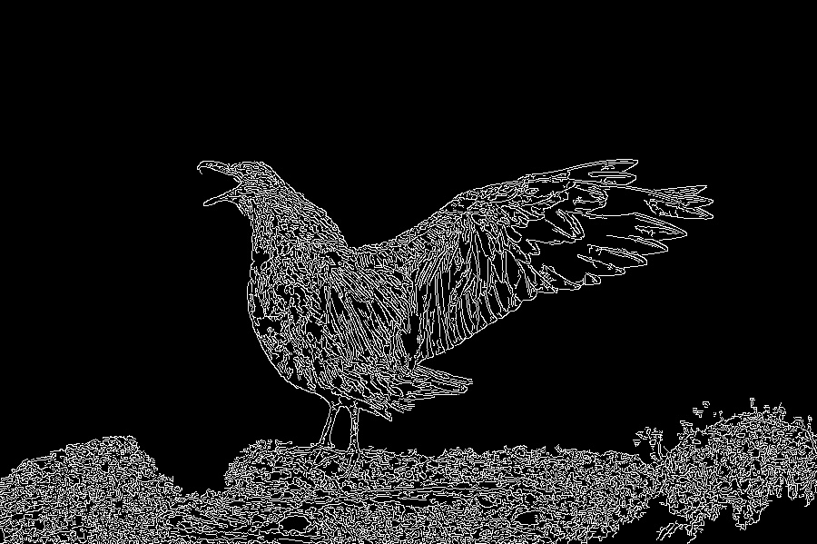
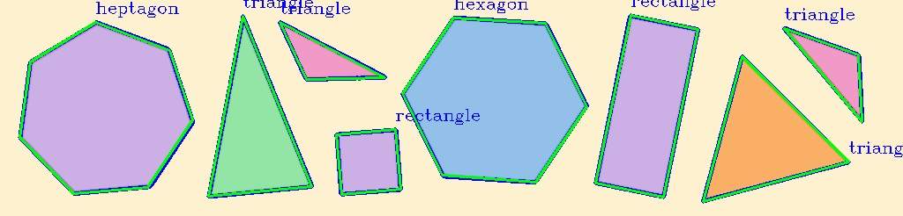

# OpenCV Journey (Computer Vision)

This folder documents my hands-on journey with OpenCV, covering core computer vision concepts from basic image handling to real-time object detection.

---

## Overview

The goal of this module is to build a strong foundation in classical computer vision techniques using OpenCV.

---

## Structure

---

## Topics Covered

### Image Basics
- Loading & displaying images
- Converting to grayscale
- Saving images

### Drawing & Transformations
- Drawing shapes (circle, rectangle, lines)
- Cropping, resizing, rotation
- Adding text to images

### Video Processing
- Capturing video from webcam
- Writing video to file

### Image Filtering
- Gaussian Blur
- Median Blur
- Canny Edge Detection
- Thresholding
- Image sharpening

### Contours & Shape Detection
- Finding contours
- Shape identification

### Object Detection
- Face detection
- Eye detection
- Smile detection (Haar Cascades)

---

## Sample Outputs

### Edge Detection


### Gaussian Blur


### Contours


---

## 🛠 Tech Used
- Python
- OpenCV

---

## How to Run

Install dependencies:

```bash
pip install opencv-python
